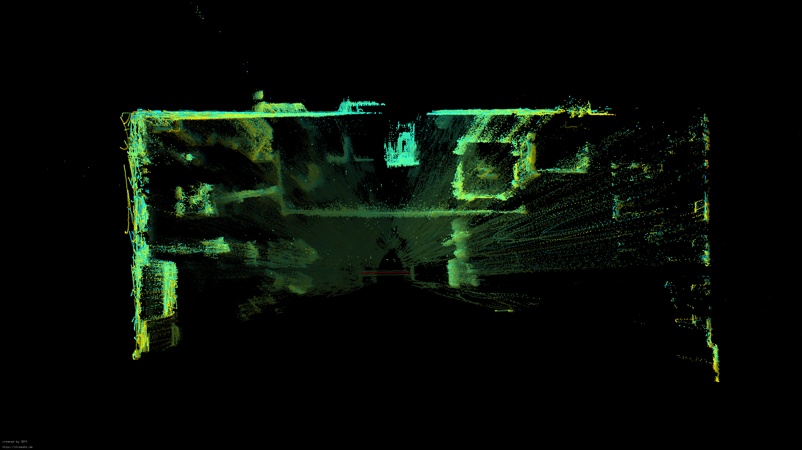
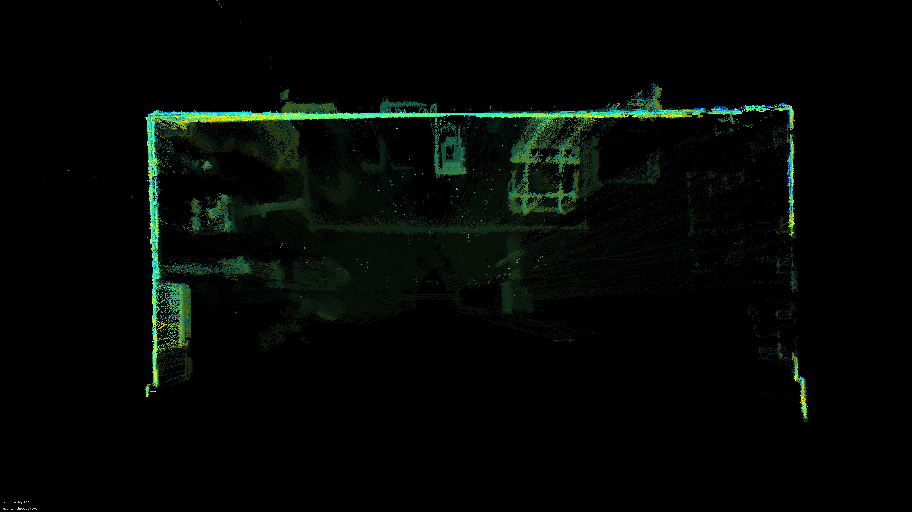
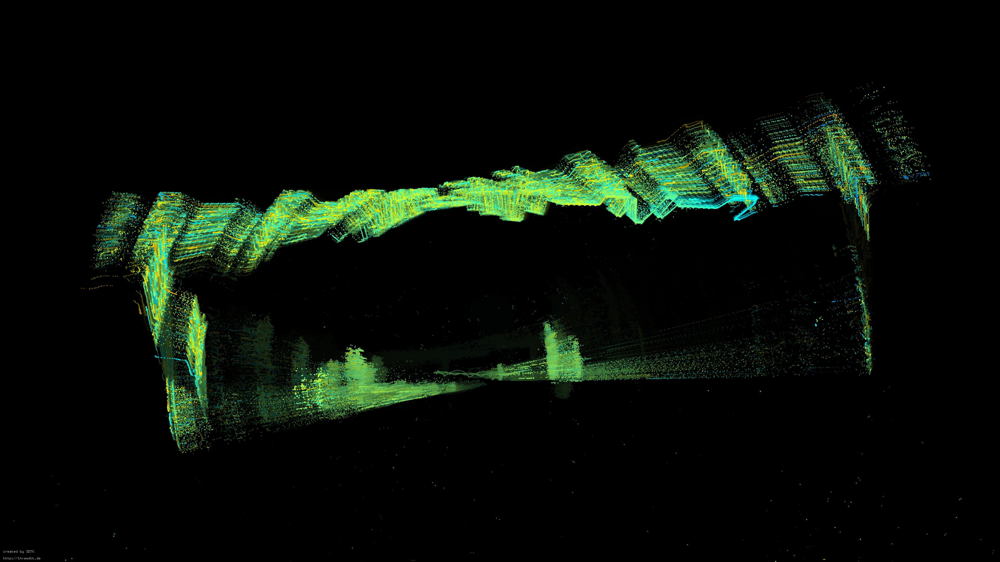
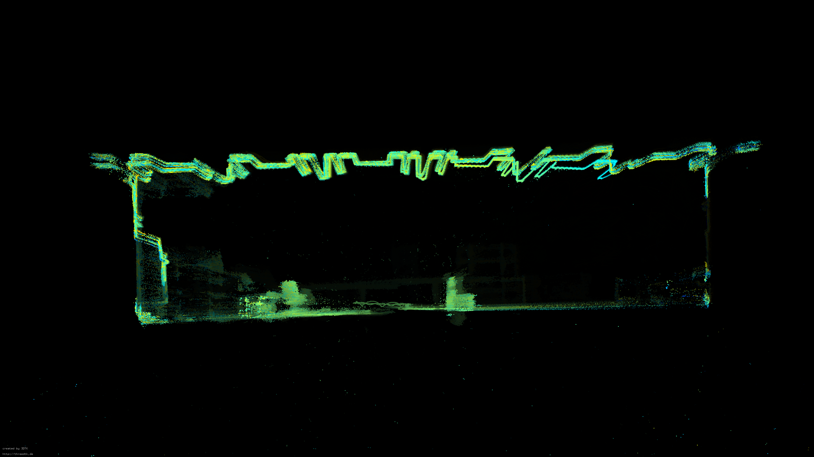
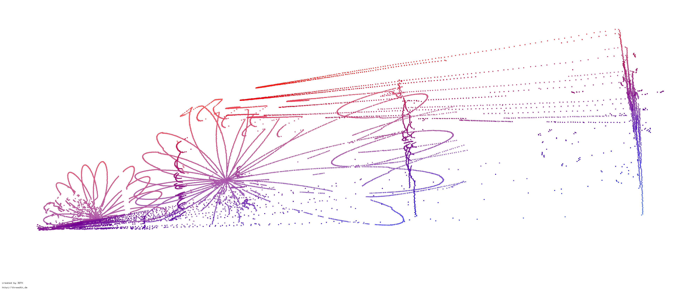
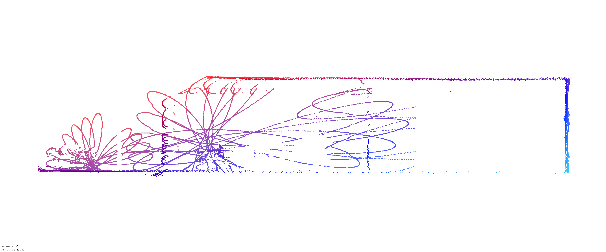

# AMDC LiDAR motion Distortion

## General

Lidar distortion is caused by the movement of a Lidar sensor during the scanning process.
Single measurement points have different reference locations in space resulting in inconsistent data.
Measured points appear at wrong distance (straight line movement) and wrong direction (vehicle is turning), resulting in Lidar distortion.

Distorted           |  Corrected
:-------------------------:|:-------------------------:
 | 
 | 
 | 

The distortion error is increased with faster movement, meaning higher linear or angular velocity.
Measurements from recent scanning positions exhibit less errors than the ones at the start of the scan.
Assuming the relative angular velocity between a vehicle and a measured object is 45 deg/s and a single frame of a LiDAR takes 100 ms (10Hz), then the distortion from the first measured angle position to the last is

$90.0 \frac{deg}{s} * 0.1 s = 9.0deg$

This distortion angle will distort points at a bigger distance much more than points located closer to the sensor and may thus make a considerable impact on the quality of the output point cloud.

However, the Lidar distortion correction presented can correct the distortion assuming constant known turn rate during measurement.
Additional inconsistency may be introduced by processing delays of applications using the resulting point cloud.
Once delays or at least a lower bound are known a priori, the delay can be anticipated by converting/extrapolating the measurement to future frames.
This increases performance and accuracy of applications relying on the point cloud.

This motion distortion correction is concerned with the motion distortion correction of a 3D Livox lidar (MID100) mounted on a spehrical robot. This results in predominantly angular motion distortion. It can however, be used for any type of LiDAR sensor.

Further information can be found in [this paper](https://tobepublished.org) [1]
More information about distortions due to predominantly linear velocity, can be found in [this paper](https://ieeexplore.ieee.org/document/9128372) [2].

[1] Heinisch, P., Arzberger, F., Nüchter, A., "Inertial LiDAR Motion Distortion Correction on Spherical Mobile Mapping Systems for Planetary Exploration", 2024

[2] Renzler, T., Stolz, M., Schratter, M., and Watzenig, D. "Increased accuracy for fast moving LiDARS: Correction of distorted point clouds." 2020 IEEE International Instrumentation and Measurement Technology Conference (I2MTC). IEEE, 2020.

## ROS Node

The repository code contains a fully operational ROS node for Livox Lidar distortion correction.
It requires a point cloud (livox_ros_driver::CustomMsg) and imu data (sensor_msgs::Imu).
Angular velocities are averaged between current and previous measurement. The IMU frame needs to be alligned with the LiDAR frame. This is done in the IMU callback function: Change if necessary!

Terminal 1 - Execution:
```
$ mkdir ~/lidar_distortion_ws
$ cd ~/lidar_distortion_ws
$ catkin_make
$ cd src
$ git clone
$ cd ..
$ catkin_make
$ source devel/setup.bash
$ roslaunch sr_lidar_distortion_correction
$ sr_lidar_distortion_correction.launch
```

Terminal 2 - Data:
```
$ rosbag play ~/path_to_data
```
